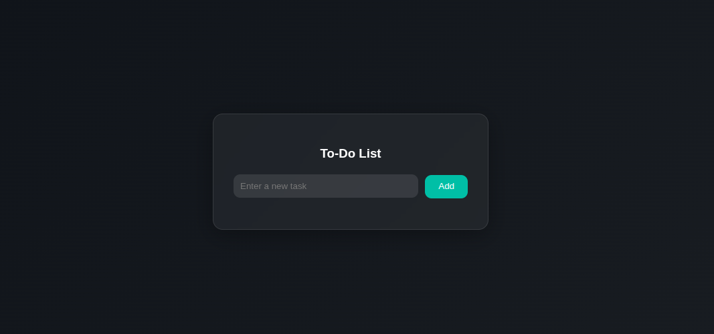
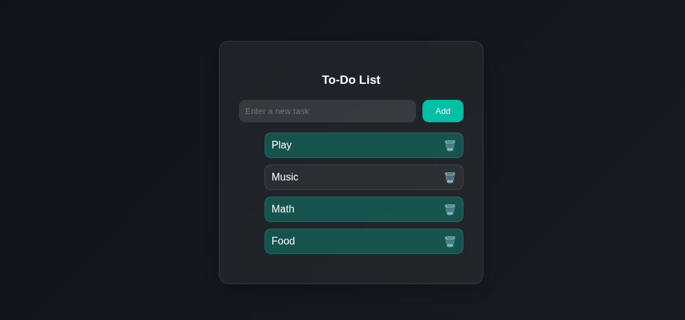

# To-Do App 📝


## Description
A simple modern interactive To-Do application** featuring a glassmorphism design. Users can:  
- Add new tasks  
- Mark tasks as completed (with a highlight)  
- Delete tasks using a bin icon  
- Persist tasks across page reloads with localStorage  

This project demonstrates HTML, CSS, and JavaScript skills, including DOM manipulation, event handling, animations, and localStorage.

---

## Demo

  
 

## Live Demo:
[https://ebelielk.github.io/todo-app/]

---

## Technologies Used
- HTML5  
- CSS3 (Glassmorphism & Animations)  
- JavaScript (DOM Manipulation & localStorage)  

---

## Features
- Modern dark/glassmorphism design  
- Smooth fade-in animation for tasks  
- Highlight tasks when completed  
- Delete tasks using a bin icon  
- Persistent tasks using localStorage  

---

## Installation / How to Run
1. Clone the repository:

```bash
git clone https://github.com/Ebelielk/todo-app.git
